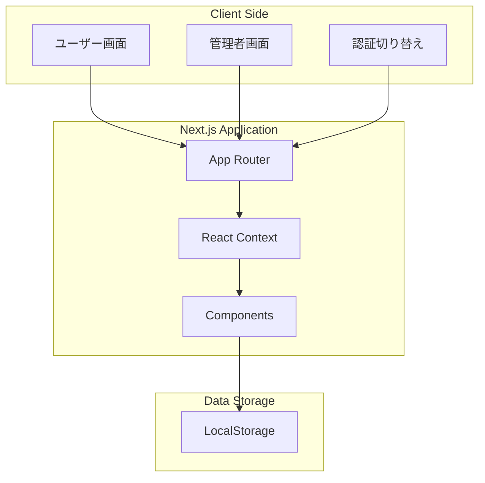
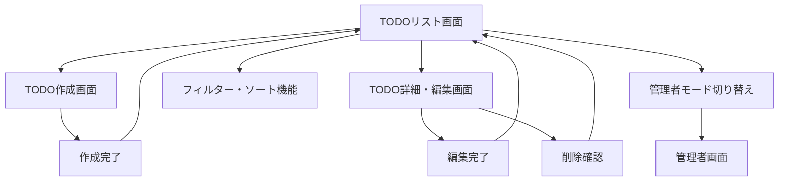
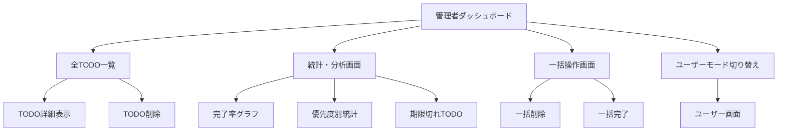

# Next.js TODOアプリ設計書

## 1. プロジェクト概要

### 1.1 目的
シンプルで使いやすいTODO管理アプリケーションの構築
ユーザー画面と管理者画面を分離したWebアプリケーション

### 1.2 主要機能
- **ユーザー画面**: TODO作成・表示・編集・削除（CRUD操作）
- **管理者画面**: 全TODOの管理・統計表示

## 2. システム構成

### 2.1 技術スタック
```
フロントエンド: Next.js 14 (App Router) + TypeScript
UI Framework: Tailwind CSS + shadcn/ui
状態管理: React Context API + useReducer
データ永続化: LocalStorage (シンプル構成)
認証: 簡易認証（管理者/ユーザー切り替え）
デプロイ: Vercel
```

### 2.2 システム構成図


## 3. データ設計

### 3.1 データ構造
```typescript
// TODO項目の型定義
interface Todo {
  id: string;
  title: string;
  description?: string;
  completed: boolean;
  priority: 'low' | 'medium' | 'high';
  createdAt: Date;
  updatedAt: Date;
  dueDate?: Date;
}

// アプリケーション状態
interface AppState {
  todos: Todo[];
  filter: 'all' | 'active' | 'completed';
  sortBy: 'createdAt' | 'dueDate' | 'priority';
  isAdmin: boolean;
}
```

### 3.2 LocalStorage構造
```json
{
  "todos": [
    {
      "id": "uuid-1",
      "title": "サンプルTODO",
      "description": "説明文",
      "completed": false,
      "priority": "medium",
      "createdAt": "2025-01-01T00:00:00.000Z",
      "updatedAt": "2025-01-01T00:00:00.000Z",
      "dueDate": "2025-01-02T00:00:00.000Z"
    }
  ],
  "appSettings": {
    "isAdmin": false,
    "theme": "light"
  }
}
```

## 4. 画面設計

### 4.1 ユーザー画面構成


### 4.2 管理者画面構成


## 5. 主要機能仕様

### 5.1 ユーザー画面機能

#### 5.1.1 TODO一覧表示
- 全TODO項目の表示
- 完了/未完了の切り替え表示
- フィルター機能（全て/進行中/完了済み）
- ソート機能（作成日/期限日/優先度）

#### 5.1.2 TODO作成
- タイトル入力（必須）
- 説明文入力（任意）
- 優先度設定（低/中/高）
- 期限日設定（任意）

#### 5.1.3 TODO編集
- 既存TODO項目の編集
- 完了状態の切り替え
- 削除機能（確認ダイアログ付き）

### 5.2 管理者画面機能

#### 5.2.1 ダッシュボード
- TODO統計情報表示
  - 総TODO数
  - 完了率
  - 期限切れTODO数
  - 優先度別分布

#### 5.2.2 全TODO管理
- 全TODO項目の一覧表示
- 検索機能
- 一括操作（削除/完了）
- データエクスポート機能

#### 5.2.3 分析機能
- 完了率の推移グラフ
- 優先度別統計
- 期限切れTODOアラート

## 6. UI/UX設計

### 6.1 デザインシステム
- **カラーパレット**: 
  - Primary: Blue (#3B82F6)
  - Success: Green (#10B981)
  - Warning: Yellow (#F59E0B)
  - Danger: Red (#EF4444)
- **タイポグラフィ**: Inter フォント
- **レスポンシブ**: Mobile First設計

### 6.2 主要コンポーネント
- TodoCard: TODO項目表示カード
- TodoForm: TODO作成・編集フォーム
- FilterBar: フィルター・ソートバー
- StatCard: 統計情報カード
- ConfirmDialog: 確認ダイアログ

## 7. ディレクトリ構成

```
nextjs-todo-app/
├── src/
│   ├── app/
│   │   ├── (user)/
│   │   │   ├── page.tsx          # TODOリスト画面
│   │   │   ├── create/
│   │   │   │   └── page.tsx      # TODO作成画面
│   │   │   └── edit/
│   │   │       └── [id]/
│   │   │           └── page.tsx  # TODO編集画面
│   │   ├── admin/
│   │   │   ├── page.tsx          # 管理者ダッシュボード
│   │   │   ├── todos/
│   │   │   │   └── page.tsx      # 全TODO管理
│   │   │   └── analytics/
│   │   │       └── page.tsx      # 分析画面
│   │   ├── globals.css
│   │   ├── layout.tsx
│   │   └── page.tsx              # ホーム画面
│   ├── components/
│   │   ├── ui/                   # shadcn/ui コンポーネント
│   │   ├── todo/
│   │   │   ├── TodoCard.tsx
│   │   │   ├── TodoForm.tsx
│   │   │   ├── TodoList.tsx
│   │   │   └── FilterBar.tsx
│   │   ├── admin/
│   │   │   ├── Dashboard.tsx
│   │   │   ├── StatCard.tsx
│   │   │   └── AnalyticsChart.tsx
│   │   └── layout/
│   │       ├── Header.tsx
│   │       ├── Navigation.tsx
│   │       └── ModeToggle.tsx
│   ├── contexts/
│   │   └── TodoContext.tsx       # TODO状態管理
│   ├── hooks/
│   │   ├── useTodos.ts
│   │   ├── useLocalStorage.ts
│   │   └── useAdmin.ts
│   ├── lib/
│   │   ├── utils.ts
│   │   ├── storage.ts
│   │   └── constants.ts
│   └── types/
│       └── todo.ts
├── public/
├── package.json
├── next.config.js
├── tailwind.config.js
└── tsconfig.json
```

## 8. 開発フェーズ

### Phase 1: 基盤構築（1週間）
- Next.jsプロジェクト初期化
- 基本UI コンポーネント作成
- LocalStorage操作ライブラリ実装
- Context API設定

### Phase 2: ユーザー機能（1-2週間）
- TODO一覧画面実装
- TODO作成・編集機能
- フィルター・ソート機能
- レスポンシブ対応

### Phase 3: 管理者機能（1週間）
- 管理者ダッシュボード
- 統計・分析機能
- 一括操作機能
- データエクスポート

### Phase 4: 最適化・テスト（3-5日）
- パフォーマンス最適化
- ユーザビリティテスト
- バグ修正
- デプロイ準備

## 9. 主要画面ワイヤーフレーム

### 9.1 ユーザー画面（TODOリスト）
```
┌─────────────────────────────────────┐
│ TODO App                    [Admin] │
├─────────────────────────────────────┤
│ [+ 新しいTODO]                      │
│                                     │
│ [全て] [進行中] [完了]   [ソート▼]  │
├─────────────────────────────────────┤
│ ☐ サンプルTODO1          [編集][削除]│
│   期限: 2025/01/02  優先度: 高      │
├─────────────────────────────────────┤
│ ☑ 完了したTODO           [編集][削除]│
│   期限: 2025/01/01  優先度: 中      │
└─────────────────────────────────────┘
```

### 9.2 管理者画面（ダッシュボード）
```
┌─────────────────────────────────────┐
│ 管理者ダッシュボード        [User]   │
├─────────────────────────────────────┤
│ [総TODO数: 25] [完了率: 60%]        │
│ [期限切れ: 3]  [今日期限: 5]        │
├─────────────────────────────────────┤
│ ■ 完了率推移グラフ                  │
│ ■ 優先度別分布                      │
├─────────────────────────────────────┤
│ [全TODO管理] [分析画面] [エクスポート]│
└─────────────────────────────────────┘
```

## 10. 技術的考慮事項

### 10.1 パフォーマンス
- React.memo によるコンポーネント最適化
- useMemo/useCallback による再レンダリング抑制
- 仮想スクロール（TODO数が多い場合）

### 10.2 アクセシビリティ
- キーボードナビゲーション対応
- スクリーンリーダー対応
- 適切なARIAラベル設定

### 10.3 データ管理
- LocalStorageの容量制限対応
- データバックアップ・復元機能
- データ整合性チェック

---

この設計書はシンプルで実装しやすい構成となっており、段階的に機能を追加できる拡張性も考慮しています。